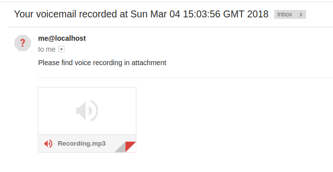
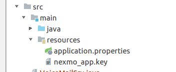

# Voice mail application


As a business owner it's not always easy to handle huge volume of calls 24/7. On another hand each customer is important and it deserve to be served well.

To kick off development you can [checkout demo repository]( https://github.com/Nexmo/ruby-sms-customer-support/) 

## In this tutorial

In this tutorial we build simple voice mail forwarder where 
callers asked to leave a voice message which will be sent to 
the email using [Nexmo Voice API](https://developer.nexmo.com/api/voice) as an attachment. 
Example of outcome:



To do this:

* [Configure environment](#configure-environment)
* [Create a voice application and assign it to the phone number using Nexmo CLI](#create-an-voice-application)
* [Build a simple Spring Boot application](#spring-boot-application-skeleton) 
* [Handle call events](#handle-call-events) 
* [Handle recording webhook event and email record](#handle-recording-webhook-event-and-email-record)


## Prerequisites

* [A Nexmo account](https://dashboard.nexmo.com/sign-up) 
* [Demo Source code](https://github.com/ruXlab/nexmo-voicemail)
* [The Nexmo CLI](https://github.com/nexmo/nexmo-cli) installed and set up


### Configure environment

Service has to be available from the internet. The easiest way to do so is to use tunnel such as ngrok or servio.net:

```bash
ssh -R 80:localhost:8080 serveo.net
Forwarding HTTP traffic from https://iste.serveo.net
```

It will forward all incoming traffic from the randomly assigned host to your machine to port 8080.

### Create an voice application

Next step is to create application associated with this service

```bash
➜  nexmo app:create "voicemail app" https://iste.serveo.net/answer https://iste.serveo.net/event \
             --keyfile nexmo_app.key
Application created: 0d76428d-a914-4d65-8c38-814d76986391
Private Key saved to: nexmo_app.key
``` 

Afterwards we can purchase phone number and link it to the app

```bash
➜  nexmo number:buy --country_code GB --confirm
Number purchased: 441414658675

➜  nexmo link:app 441414658675 0d76428d-a914-4d65-8c38-814d76986391
Number updated

```


### Spring Boot Application skeleton 

In this gradle file apart of spingboot itself we also need two more dependencies: spring-mail for SMTP client and [nexmo-java](https://github.com/Nexmo/nexmo-java) library which simplifies access to the Nexmo APIs

```gradle
dependencies {
    . . . 
    compile 'com.nexmo:client:3.3.0'
    compile "org.springframework.boot:spring-boot-starter-web:2.0.0.RELEASE"
    compile 'org.springframework.boot:spring-boot-starter-mail:2.0.0.RELEASE'
}
```

Main application class is very basic but we need to add a bean factory for `NexmoClient` for further handy access:

```java
@SpringBootApplication
public class VoiceMailSrv {
    public static void main(String[] args) {
        SpringApplication.run(VoiceMailSrv.class, args);
    }

    @Bean
    public NexmoClient nexmoClient(
            @Value("${nexmoApplicationId}") String applicationId,
            @Value("classpath:nexmo_app.key") Resource cert
    ) throws IOException, NoSuchAlgorithmException, InvalidKeyException, InvalidKeySpecException {
        return new NexmoClient(new JWTAuthMethod(applicationId, Files.readAllBytes(cert.getFile().toPath())));
    }
}
```

Here you might notice that we need to provide `applicationId` and key, generated using nexmo-cli. To do so put `nexmo_app.key` to the `resources` folder and create `application.properties` file where spring boot will pick up application configuration.



In resouces file you need to provide applicationId and additional configuration for SMTP server:

```
nexmoApplicationId = 0d76428d-a914-4d65-8c38-814d76986391
destinationEmail = bob@email.com
senderEmail = me@localhost


# Email server configuration
spring.mail.host=smtp.gmail.com
spring.mail.port=587
spring.mail.username=<login user to smtp server>
spring.mail.password=<login password to smtp server>
spring.mail.properties.mail.smtp.auth=true
spring.mail.properties.mail.smtp.starttls.enable=true
```


As it normal spring configuration it can be provided/overloaded via environment variables, command line arguments and [many other options](https://docs.spring.io/spring-boot/docs/current/reference/html/boot-features-external-config.html)

More information about SMTP configuration can be found in [blog post on Baeldug](http://www.baeldung.com/spring-email)


### Handle call events 

When Nexmo receives an inbound call to purchased number it makes a request to the webhook endpoint you set when you created a Voice application. There are two of them - **AnswerURL** used to provide [NCCO Object](https://developer.nexmo.com/api/voice/ncco) and **EventURL** for events happening throughout call lifecycle


To instruct Nexmo about actions we need to return NCCO Object when we recieve call on **AnswerURL**, our controller handler should look like:


In our case we design NCCO of following actions:

* [**Talk**](https://developer.nexmo.com/api/voice/ncco#talk) - Using Nexmo TTS say _"Thanks for calling us. Please leave your message and press hash key"_ 
* [**Record**](https://developer.nexmo.com/api/voice/ncco#record) - Record a message and put it on Nexmo Media service. In this action we need to provide callback url to be called when voice message is recorded
* [**Talk**](https://developer.nexmo.com/api/voice/ncco#talk) - Speak _"Thank you. Your message has been recorded. Bye"_


```java
@GetMapping("/answer")
public Object onAnswer(
        @RequestParam("conversation_uuid") String conversation,
        @RequestParam("from") String caller,
        HttpServletRequest request
) {
    log.info("onAnswer: got call from {} (conversation {})", caller, conversation);
    return new NccoResponseBuilder()
        .appendNcco(new TalkNcco("Thanks for calling us. Please leave your message and press hash key"))
        .appendNcco(new RecordNcco() {{
            String schema = Optional.ofNullable(request.getHeader("x-forwarded-proto")).orElse(request.getScheme());
            String host = Optional.ofNullable(request.getHeader("host")).orElse(request.getLocalAddr());
            setBeepStart(true);
            setEndOnKey('#');
            setEventUrl(String.format("%s://%s/record", schema, host));
            setEventMethod("GET");
        }})
        .appendNcco(new TalkNcco("Thank you. Your message has been recorded. Bye"))
        .getValue().toJson();
}

```


No need to craft NCCO manually - it can be done by using fluent API. 


Also, we need a SMTP server. There are plenty of options such as [sendgrid](https://sendgrid.com) or [mailgun](https://www.mailgun.com/). 


### Handle recording webhook event and email record

When recording is finished the specified callback for **record** action will be called with url to mp3 file. Our handler should download it and compose an email attaching it. 

```java

@GetMapping("/record")
public void onRecordingFinished(
        @RequestParam("recording_url") String recordingUrl
) throws MessagingException, IOException, NexmoClientException {
    log.info("onRecordingFinished: new recording detected: {}", recordingUrl);

    Recording recording = nexmoClient.getVoiceClient().downloadRecording(recordingUrl);
    byte[] binaryRecording = IOUtils.toByteArray(recording.getContent());
    log.info("onRecordingFinished: recording has been downloaded, {}bytes", binaryRecording.length);

    MimeMessage message = emailSender.createMimeMessage();

    MimeMessageHelper helper = new MimeMessageHelper(message, true);

    helper.setFrom(senderEmail, "Voicemail demo service");
    helper.setSubject("Your voicemail recorded at " + new Date());
    helper.addTo(destinationEmail);
    helper.setText("Please find voice recording in attachment");

    helper.addAttachment("Recording.mp3", () -> new ByteArrayInputStream(binaryRecording), "audio/mpeg3");

    emailSender.send(message);
    log.info("onRecordingFinished: email has been sent to {}", destinationEmail);
}

```

Media storage is protected by JWT authorization but `NexmoClient` simplifies access to it and returns `InputStream` we can work with

The full code of controller can be found [on github](https://github.com/ruXlab/nexmo-voicemail/blob/master/src/main/java/com/nexmo/demo/voicemail/VoiceMailController.java)


# Conclusion

In this tutorial we quickly built simple voicemail recorder using seamlessly integrated nexmo-client to the spring boot application

Nexmo has various actions in NCCO and combining them together it is possible to create endless applications for different use cases.  